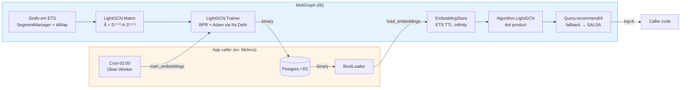
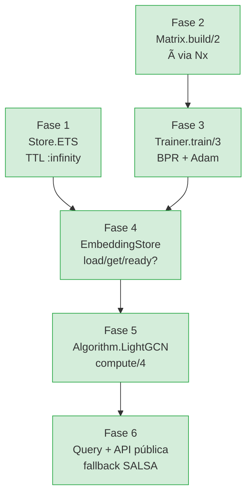
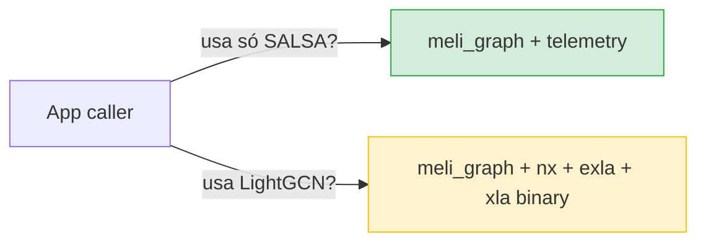
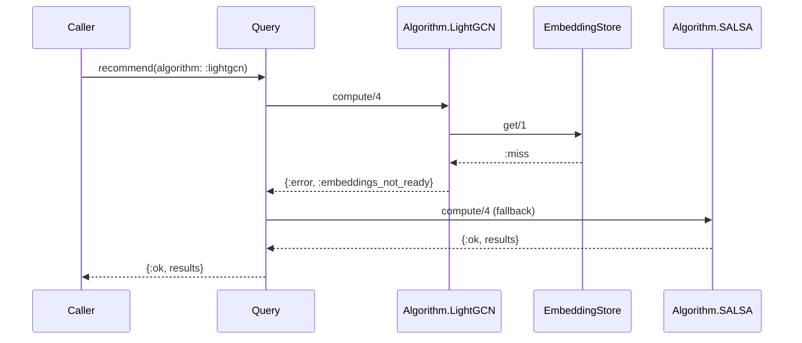

# LightGCN — v0.2

Documentação visual da implementação do LightGCN no MeliGraph.

> **Referência:** *He et al., "LightGCN: Simplifying and Powering Graph
> Convolution Network for Recommendation", SIGIR 2020*

---

## Visão geral

LightGCN é um modelo de filtragem colaborativa que aprende embeddings de
usuários e itens propagando-os linearmente pelo grafo bipartido user↔item.
A inferência é puramente algébrica (dot product), o que permite servir
recomendações em microssegundos depois de treinado.

A v0.2 do MeliGraph traz a implementação completa:

- **Treino offline** via `Nx.Defn` + BPR loss + Adam manual
- **Inferência online** via `Algorithm.LightGCN` com fallback automático para SALSA
- **Separação lib/app**: a lib produz e consome `binary`, o app caller persiste
- **Sem mudança na API de recomendação**: basta passar `algorithm: :lightgcn`

---

## Arquitetura — fluxo ponta-a-ponta



A lib **nunca toca disco** — só `binary` cruza a fronteira lib/app.

---

## Pipeline de implementação (Fases 1–6)



Todas as fases entregues. Plano detalhado em
[lightgcn-v02-implementation.md](lightgcn-v02-implementation.md).

---

## Estrutura de módulos

```
lib/meli_graph/
├── lightgcn/                          ← novo (v0.2)
│   ├── matrix.ex                      ← Ã via Nx (denso)
│   ├── trainer.ex                     ← defn + BPR + Adam
│   └── embedding_store.ex             ← ciclo de vida no ETS
├── algorithm/
│   └── lightgcn.ex                    ← Algorithm behaviour (inferência)
├── store/
│   └── ets.ex                         ← TTL :infinity (mudou)
└── query/
    └── query.ex                       ← :lightgcn + fallback (mudou)

lib/meli_graph.ex                      ← train/load/ready (mudou)
config/config.exs                      ← EXLA setup (novo)
bench/lightgcn_gowalla_eval.exs        ← script de validação (novo)
```

---

## Como funciona — em uma equação

**Light Graph Convolution:**

$$
e_u^{(k+1)} = \sum_{i \in N_u} \frac{1}{\sqrt{|N_u|}\sqrt{|N_i|}} \, e_i^{(k)}
$$

**Layer combination** (média uniforme das K+1 camadas):

$$
e_u = \frac{1}{K+1} \sum_{k=0}^{K} e_u^{(k)}
$$

**Predição:**

$$
\text{score}(u, i) = e_u^\top \cdot e_i
$$

**Forma matricial** (o que o trainer realmente computa):

$$
\tilde{A} = D^{-1/2} \cdot A \cdot D^{-1/2}, \quad
E^{(k+1)} = \tilde{A} \cdot E^{(k)}
$$

Os únicos parâmetros treináveis são `E^(0)`. Tudo mais é derivado por
propagação — o modelo é tão simples quanto Matrix Factorization em
número de parâmetros.

---

## Como usar

### 1. Instalar dependências

```elixir
# mix.exs
def deps do
  [
    {:meli_graph, "~> 0.2.0"},
    {:nx, "~> 0.9"},
    {:exla, "~> 0.9"}
  ]
end
```

### 2. Configurar EXLA

```elixir
# config/runtime.exs (no app caller)
config :nx, default_backend: EXLA.Backend
config :nx, :default_defn_options, compiler: EXLA
```

### 3. Treinar (offline — Oban worker às 2h da manhã)

```elixir
defmodule Melivra.Graph.Workers.TrainEmbeddingsWorker do
  use Oban.Worker, queue: :graph, max_attempts: 3

  @impl Oban.Worker
  def perform(%Oban.Job{args: %{"graph_name" => name, "user_prefix" => prefix}}) do
    name_atom = String.to_existing_atom(name)

    with {:ok, binary} <- MeliGraph.train_embeddings(name_atom,
                            user_prefix: prefix,
                            embedding_dim: 64,
                            layers: 3,
                            epochs: 1000),
         {:ok, _} <- Repo.insert(%GraphEmbedding{
                       graph_name: name,
                       data: binary,
                       trained_at: DateTime.utc_now()
                     }),
         :ok <- MeliGraph.load_embeddings(name_atom, binary) do
      Logger.info("[LightGCN] #{name} treinado e ativo")
      :ok
    end
  end
end
```

### 4. Carregar no boot (após restart do app)

```elixir
defmodule Melivra.Graph.BootLoader do
  def load do
    embedding =
      Repo.one(
        from e in GraphEmbedding,
        where: e.graph_name == "professor_graph",
        order_by: [desc: e.trained_at],
        limit: 1
      )

    case embedding do
      nil ->
        Logger.warning("[LightGCN] sem embeddings — SALSA será usado como fallback")

      %{data: binary} ->
        :ok = MeliGraph.load_embeddings(:professor_graph, binary)
        Logger.info("[LightGCN] embeddings carregados")
    end
  end
end
```

### 5. Recomendar (online — request path)

```elixir
{:ok, recs} = MeliGraph.recommend(:professor_graph, "profile:42", :content,
  algorithm: :lightgcn,
  top_k: 16
)

# Se embeddings não carregados → fallback transparente para SALSA.
# Caller não precisa tratar.
```

---

## Hiperparâmetros

| Parâmetro | Default | Referência |
|-----------|---------|------------|
| `:embedding_dim` | 64 | paper §4.1.2 |
| `:layers` | 3 | paper §4.2 |
| `:epochs` | 1000 | paper §4.1.2 |
| `:batch_size` | 1024 | paper §4.1.2 |
| `:learning_rate` | 0.001 | Adam default |
| `:lambda` | 1.0e-4 | paper §4.1.2 |

---

## Dependências novas

| Lib | Tipo | Por que |
|-----|------|---------|
| **`:nx ~> 0.9`** | optional | Tensores e `Nx.Defn` para autodiff. Sem isso, o LightGCN não compila |
| **`:exla ~> 0.9`** | optional | Compila `defn` para XLA (CPU/GPU). Sem isso, o trainer roda no `BinaryBackend` (~1000× mais lento) |

Ambas são `optional: true` no `mix.exs` — apps que só usam SALSA/PageRank
**não pagam o custo** do download/compile do XLA. Apps que usam o LightGCN
adicionam essas deps no seu próprio `mix.exs`.



---

## Performance

Medições no dataset **Gowalla** do paper (29858 users / 40981 items),
em CPU (Intel x86_64), com EXLA:

| Subgrafo | dim | epochs | Treino | Inferência |
|----------|-----|--------|--------|------------|
| 30 users / 793 nós | 16 | 30 | 0.8s | 0.1s |
| 500 users / 5088 nós | 32 | 100 | 99s | 5s |

**Sem EXLA** (BinaryBackend): o mesmo treino de 30 users / 30 epochs
levou >27 minutos (escala O(n²) em Elixir puro).

**Conclusão prática:** EXLA é obrigatório para qualquer uso de produção
ou validação séria.

---

## Validação empírica

Avaliação seguindo o protocolo do paper (recall@20, NDCG@20):

```
┌──────────────────────────────────────────────────────────┐
│  500 users · 100 epochs · dim=32 · lr=0.01 · λ=1e-3      │
│  subgrafo Gowalla, seed fixa                             │
├──────────────────────────────────────────────────────────┤
│  recall@20        :  0.0365                              │
│  ndcg@20          :  0.0305                              │
│  random baseline  :  0.0020                              │
│  uplift           :  18.59x  ← muito acima do random     │
└──────────────────────────────────────────────────────────┘
```

O modelo claramente aprende sinal colaborativo a partir do `train.txt` e
generaliza para o `test.txt`. NDCG > 0 indica que os hits caem em posições
altas do ranking, não distribuídos uniformemente.

> **Por que ainda longe dos números do paper (recall=0.183 em Gowalla cheia):**
> rodamos em subgrafo de 500 users, vs 30k do paper — 60× menos sinal.
> Para reproduzir os números absolutos é preciso a representação sparse
> (planejada para v0.3, ver Limitações).

Reproduzir:

```bash
# train.txt e test.txt no formato do paper:
#   user_id item1 item2 item3 ...

mix run bench/lightgcn_gowalla_eval.exs \
  --train ~/Downloads/train.txt \
  --test ~/Downloads/test.txt \
  --users 500 --epochs 100 --dim 32 --lr 0.01 --lambda 1.0e-3
```

---

## Fallback transparente

Se o app caller chamar `recommend(..., algorithm: :lightgcn)` antes de
`load_embeddings/2`, o `Query` faz fallback automático para SALSA — o
caller não precisa tratar.



---

## Limitações conhecidas

1. **Matriz densa.** `Matrix.build/2` materializa à como `Nx.tensor` denso
   `(n × n)`. Para Gowalla cheio (~70k nós) seriam ~19 GB de RAM.
   Para grafos > ~10k nós, é preciso a representação sparse — planejada
   para v0.3.

2. **Sem retreinamento incremental.** Cada treino parte do Xavier init.
   Warm start (parir do `E^(0)` anterior) reduziria épocas necessárias
   de ~1000 para ~100-200. Planejado v0.3.

3. **Negative sampling uniforme.** Pode gerar falsos negativos em grafos
   esparsos. O paper aceita esse trade-off; estratégias mais sofisticadas
   (hard negative, adversarial) ficam para v0.3+.

4. **Cold start de items.** Itens inseridos depois do treino não têm
   embedding e ficam invisíveis ao LightGCN. Use SALSA ou GlobalRank
   como fallback hierárquico.

---

## Roadmap

| Versão | Item | Status |
|--------|------|--------|
| v0.2 | Implementação base | ✅ |
| v0.2 | EXLA opcional | ✅ |
| v0.2 | Validação Gowalla | ✅ |
| v0.3 | Sparse adjacency (escala 50k+ nós) | ⏳ |
| v0.3 | Retreinamento incremental (warm start) | ⏳ |
| v0.3 | Cold start hierárquico documentado | ⏳ |
| v0.3 | Hard negative sampling | ⏳ |

---

## Referências

1. He et al., **"LightGCN: Simplifying and Powering Graph Convolution Network for Recommendation"**, SIGIR 2020. https://doi.org/10.1145/3397271.3401063
2. PyTorch Geometric LightGCN: https://pytorch-geometric.readthedocs.io/en/latest/generated/torch_geometric.nn.models.LightGCN.html
3. Kingma & Ba, **"Adam: A Method for Stochastic Optimization"**, ICLR 2015
4. Rendle et al., **"BPR: Bayesian Personalized Ranking from Implicit Feedback"**, UAI 2009
